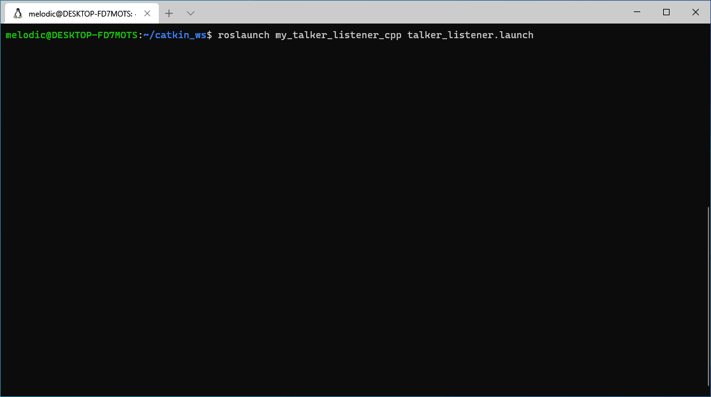

# my_talker_listener_cpp
This is a ROS package to demonstrate the communication of two nodes by publishing and subcribing to a topic.

This package was tested on ROS Melodic and Ubuntu 18.04 LTS.

## Installation
1. Create a catkin workspace.
```bash
~$ mkdir -p catkin_ws/src
~$ cd catkin_ws/src
~/catkin_ws/src$ catkin_init_workspace
```

2. Clone the repository.
```bash
~/catkin_ws/src$ git clone https://github.com/roboticsprogrammingdev/my_talker_listener_cpp.git
~/catkin_ws/src$ cd ..
```

3. Build the source and install the executables.
```bash
~/catkin_ws$ catkin_make
~/catkin_ws$ catkin_make install
```

## Demonstration
Launch the `.launch` file.
```bash
~/catkin_ws$ roslaunch my_talker_listener_cpp talker_listener.launch
```


## Blog post
Read [Creating ROS publisher and subscriber](https://blog.roboticsprogramming.dev/2020/10/creating-ros-publisher-subscriber.html).
